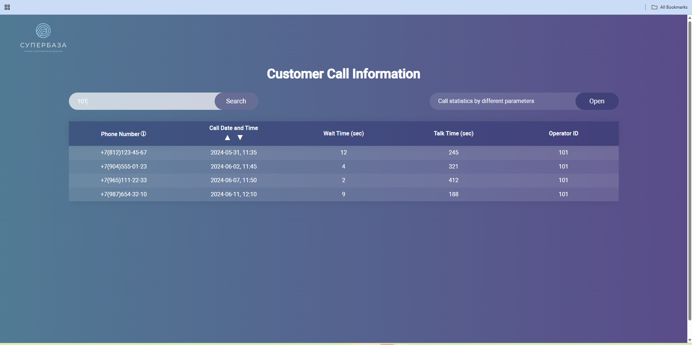
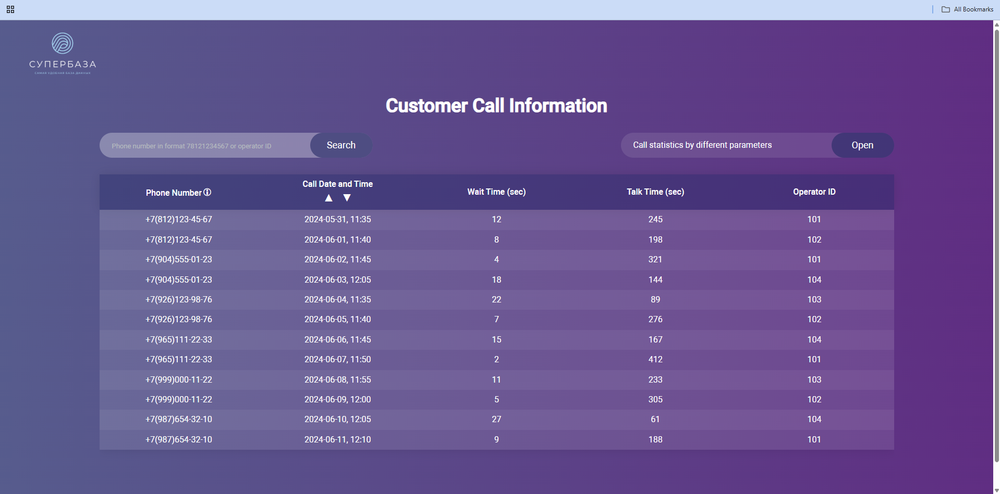
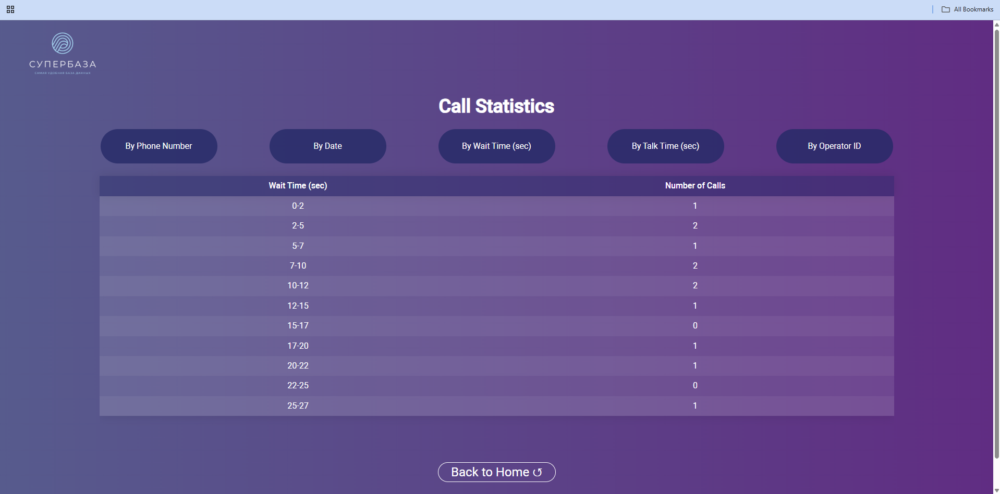

# Phone Book

## Overview

This application displays a client call database in a table view.

On the main page, the user can search by:

- phone number
- operator ID

The `Call date and time` column supports ascending and descending sorting.

When the user clicks a phone number, the app opens a page with call details for that specific number.

The app also includes a `Call statistics` section where the user can view statistics grouped by:

- phone number
- date
- answer wait time in seconds
- call duration in seconds
- operator ID

For the wait time and duration views, the data is displayed in 10 intervals.

## Screenshots

### Search Page



### Database Main Page



### Statistics Page



## Tech Stack

- React (Functional components)

## Run Locally

### Prerequisites

- Node.js LTS
- npm

### Start the app

```bash
npm install 
npm start
```

The app will start in development mode at:

```text
http://localhost:3000
```

## Local Mock Data

The app reads call records from a local JSON file:

[`src/data/calls.json`](/c:/Users/geoma/dev/phone-book/src/data/calls.json)

